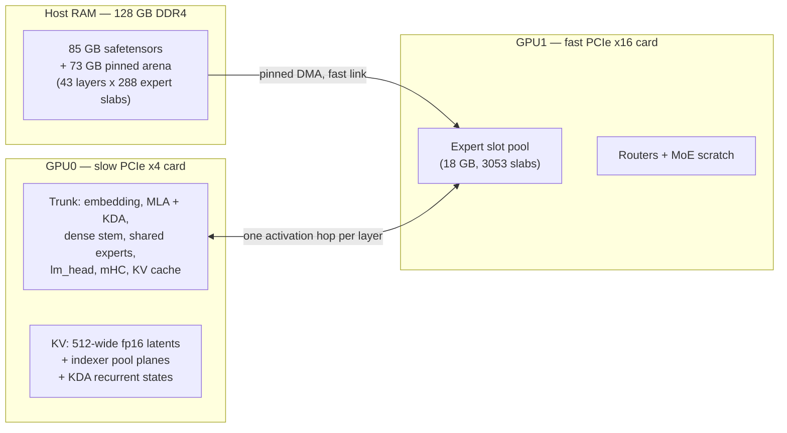

# Helios — a GLM-5.3-Flash inference engine for 2× RTX 3090

A from-scratch C++20/CUDA inference engine for **GLM-5.3-Flash in EXL3 format (2.05 bpw)**, written
for a two-card workstation where the model does not fit in VRAM. No PyTorch, no Python, no
inference framework: the forward pass, the quantization kernels, the KV cache, the tiered expert
streaming and the HTTP server are all in this repository.

The target is the awkward case that generic runtimes handle badly: **3.4 TB/s vs 25 GB/s asymmetric
PCIe links, no NVLink, and a 85 GB model against 48 GB of VRAM.** The engine is built around that
bottleneck rather than around the arithmetic.

```
246,193-token prompt      : 711.6 s       (prefill 346.3 tok/s, decode 17.8 tok/s)
32,768-token prompt       : prefill 357.0 tok/s, decode 18.3 tok/s
context                   : 262,144 tokens (the model's native window)
```

---

## Reference system

The numbers in this README were measured on the machine below — hardware specification only, since
that is what the design decisions depend on:

| component | specification |
|---|---|
| GPUs | 2× NVIDIA RTX 3090, GA102, `sm_86`, 24 GB each, **no NVLink** |
| PCIe | asymmetric: one card on **PCIe 4.0 ×16** (~25 GB/s host↔device), one on **×4** (~3.4 GB/s) |
| CPU | AMD Ryzen 7 3700X, 8 cores / 16 threads, AVX2 only (**no AVX-512, no VNNI**) |
| RAM | 128 GB DDR4-3200, ~27 GB/s measured read bandwidth |
| Software | Linux, CUDA 13.0, GCC 13, CMake + Ninja |

The ×4 card is the single most important fact in the design: anything that crosses that link is
~7× more expensive than the same transfer on the other card, so the engine keeps exactly one
activation hop per layer and puts every byte of streaming traffic on the fast link.

## The model

GLM-5.3-Flash as configured in this checkpoint:

| | |
|---|---|
| layers | 45 trunk + 1 MTP layer |
| attention | **MLA** (absorbed, 512-wide KV latent, 64 heads, NoPE) on layers 3, 7, 11, … |
| attention | **KDA** — a gated linear attention with channelwise decay — on the other 34 layers |
| MoE | 42 sparse layers (3–44) + MTP: **top-8 of 288 routed experts** + 1 shared, intermediate 2048 |
| dense stem | layers 0–2, intermediate 12288 |
| hyperconnections | mHC with 4 parallel streams, Sinkhorn routing (20 iterations) |
| indexer | DSA-style pooled selection: 32 heads × 128, top-512 pools of 4 keys |
| quantization | EXL3: 2.05 bpw routed experts, 4-bit attention, 5-bit `lm_head`, trellis-encoded |
| context | `max_position_embeddings` = 1,048,576 (262,144 allocated here) |
| weights on disk | 85.13 GB across 12 safetensors shards |

Roughly half the layers are linear-attention and half are MLA, which is why the engine has two
completely separate attention paths and a hybrid KV cache (per-position latents for MLA, a fixed
recurrent state for KDA).

## Design



The essential trick is **placement by link speed**: the trunk (which must talk to the host every
layer) goes on the slow card, and the expert pool (which receives 6 MB slabs and returns activations)
goes on the fast card. The only traffic across the slow link is one hidden-state hop per MoE layer.

The KV cache is **position-addressed and survives across requests**, which is what makes prefix
reuse nearly free: a new prompt that continues the resident history resumes where it left off without
touching the cache. The one state that is *not* position-addressed is the KDA recurrence — a conv
window plus a recurrent matrix per KDA layer — so the engine keeps a ring of those in pinned host
memory (142 MB each) and restores the newest one at or below the point where a new prompt diverges.
Snapshots live in host RAM rather than VRAM because VRAM is what context length competes for.

**Expert residency is the decode bottleneck**, and it is managed by a persistent census rather than
an in-process heuristic. The engine records per-`(layer, expert)` request counts in a
`.helios.census` file next to the model, ranks the pool by that long-run census, and pins the top
60% of slots. An earlier design ranked by in-process "heat" with the counter reset on every
eviction, which meant the pinned set was whatever phase flooded last — prefill issues ~49k requests
per chunk against a 120-token decode's ~41k. Switching to the census took residency from 30.1% to
63.7%, cut expert PCIe traffic by 32% (1437 GB → 982 GB over a 250k run) and improved decode by 41%.

## Features

- **540k context** on 2× 24 GB, via absorbed MLA latents (a 512-wide fp16 latent instead of the
  unabsorbed per-head K+V, ~72× smaller) plus fixed-size KDA recurrent state. The cap is set by GPU0
  VRAM, and reclaiming three over-sized indexer buffers moved it from 262k to 540k with no change in
  throughput (a 97k-token prompt still prefills at 349.9 tok/s) — see "KV, context and VRAM" below.
- **Cross-request prefix caching**: a request that continues or re-sends a conversation reuses the
  resident KV instead of prefilling from token 0 (measured 9–34× faster on 15–21k-token prompts).
- **Tiered expert streaming** from a 73 GB pinned RAM arena into an 18 GB VRAM slot pool, with
  pinned-memory double buffering and per-slot completion events.
- **Persistent expert ranking** (`.helios.census`) that survives restarts and re-tunes itself to the
  workload it is actually serving.
- **OpenAI-compatible HTTP server**: `/health`, `/v1/models`, `/v1/completions`,
  `/v1/chat/completions` including SSE streaming, `/metrics`.
- **Custom CUDA kernels throughout**: the EXL3 trellis decode, MLA sparse decode, the pooled
  indexer with tensor-core scoring, the KDA recurrence, the mHC mixing/Sinkhorn path, and tiled fp16
  GEMMs for the absorbed projections — each with a parity test against a CPU reference.
- **L2 persistence** requested on both cards, GPU ordering chosen from measured PCIe bandwidth, and
  a build that needs nothing but CUDA, a C++20 compiler and CMake.

## Building

```bash
cmake -B build -G Ninja
cmake --build build
```

Requirements: CUDA toolkit (13.0 used here), a C++20 host compiler, CMake ≥ 3.24, Ninja, and a CPU
with AVX2 — the build targets `x86-64-v3` (Haswell or newer). Kernels are compiled for `sm_86`, so an
RTX 3090-class card is assumed. The only third-party code is vendored: `httplib.h` and
`nlohmann/json.hpp`.

The kernel libraries under `src/cuda/` are standalone CMake projects (each with its own parity test);
the top-level build adds them as subprojects, so the two commands above build everything from a clean
checkout. Verified on a fresh clone: configure, build, and all four kernel tests pass.

Kernel-level tests build alongside the engine (`src/cuda/*/build`), and `test/` holds the
tokenizer's reference vectors.

## Running

The engine expects a standard EXL3 checkpoint directory: shards plus `model.safetensors.index.json`,
`config.json`, `tokenizer.json`, `chat_template.jinja`.

```bash
# Weight inventory, bit-width analysis, or a pure-RAM load check (no CUDA needed)
./build/helios inspect /path/to/glm53flash
./build/helios load    /path/to/glm53flash --ram-only

# One-shot generation
./build/helios gen /path/to/glm53flash --cap 262144 --chunk 8192 \
                   --tokens 64 --temp 0 --prompt "The capital of France is"

# OpenAI-compatible server
./build/helios serve /path/to/glm53flash --host 0.0.0.0 --port 8080 \
                     --cap 262144 --chunk 8192
```

`scripts/helios_server.sh` wraps the server with `start | stop | restart | status`, a PID+start-time
record, a lock against concurrent invocations, a port-in-use check, a readiness probe, stray-process
reaping and a wait for the previous instance's VRAM to be released:

```bash
./scripts/helios_server.sh start          # binds 0.0.0.0:8080
./scripts/helios_server.sh status
./scripts/helios_server.sh stop
```

## Parameters

### Command line

| flag | default | meaning |
|---|---|---|
| `--cap N` | 262144 | KV capacity in tokens; allocated up front, so lowering it frees VRAM for expert slots |
| `--chunk N` | 256 (`8192` recommended) | prefill batch size; clamped to the prompt length, so large values only cost scratch memory |
| `--host A` | 127.0.0.1 | bind address (`0.0.0.0` for LAN) |
| `--port N` | 8080 | HTTP port |
| `--api-key K` | none | require `Authorization: Bearer K` |
| `--max-tokens N` | 32768 | output length used when a request omits `max_tokens`; the engine has no other output cap |
| `--reasoning-effort L` | **high** | default reasoning effort (`low`/`high`/`max`) for requests that omit one |
| `--tokens N` | 64 | generation length for `gen` |
| `--temp T` | 0.7 | sampling temperature; `0` is greedy |
| `--prompt S` / `--prompt-file F` | — | prompt text for `gen` |
| `--prefix-snap-mb N` | 4096 | pinned host budget for prefix-cache KDA snapshots (142 MB each); `0` disables them and leaves extension-only reuse |
| `--prefix-interval N` | 8192 | tokens between snapshots; smaller means less recompute after a divergence, larger means more history is reusable |
| `--ram-only` | off | load weights into the arena without touching the GPUs |

### Environment

| variable | default | meaning |
|---|---|---|
| `HELIOS_SLOTS` | auto | expert pool size in slots; auto is `(free VRAM − 4 GiB) / slab size` |
| `HELIOS_GPU_ORDER` | auto | `trunk,slots` physical GPU indices, overriding the PCIe-bandwidth ranking |
| `HELIOS_NO_PIN` | off | do not pin the RAM arena (for low-RAM hosts; costs streaming bandwidth) |
| `HELIOS_MAX_TOKENS` | 32768 | same as `--max-tokens` |
| `HELIOS_REASONING_EFFORT` | **high** | same as `--reasoning-effort` |
| `HELIOS_PREFIX_SNAP_MB` | 4096 | same as `--prefix-snap-mb` |
| `HELIOS_PREFIX_INTERVAL` | 8192 | same as `--prefix-interval` |
| `HELIOS_PREFIX_DEBUG` | off | log the reuse decision (common prefix, mode, resume position) per request |
| `HELIOS_PREFIX_SNAP_MB` / `HELIOS_PREFIX_INTERVAL` | 4096 / 8192 | snapshot budget (pinned host) and the token interval between snapshots |
| `HELIOS_DUMP_CKV` | off | write MLA layer 0's latent cache after a prefill (prefix path), e.g. for precision studies |
| `HELIOS_PROF` | off | per-stage timing accumulators, printed at exit |
| `HELIOS_LAYER_MAJOR` | off | alternative layer-major prefill (see Limitations) |

Several debug switches exist for kernel work (`HELIOS_DUMP_*`, `HELIOS_TRACE`, `HELIOS_SELFTEST`,
`HELIOS_FORCE_SHAPE`, `HELIOS_MLA_SHAPE`, …); they are documented in the source next to their use.

## Reasoning effort

The model's chat template accepts a `reasoning_effort` of `low`, `high` or `max` and injects it as a
`Reasoning Effort: Low|High|Max` system line; anything else is treated as `max`. It is settable per
request (`reasoning_effort` or `chat_template_kwargs.reasoning_effort`) and per server
(`--reasoning-effort`, `HELIOS_REASONING_EFFORT`), where it becomes the default for requests that do
not set one. `/v1/models` advertises it.

**This engine defaults to `high`, not the model's shipped `max`.** Models in this class tend to be
released with maximum deliberation enabled, and at that setting they will spend an entire output
budget reasoning and can return no answer at all, for very little gain over `high`. This is a
bespoke engine tuned to a specific machine rather than a showcase, so the default is the setting that
actually answers. Measured on a "review this README" prompt with `max_tokens: 4000`:

| effort | finish | completion tokens | reasoning | answer | wall |
|---|---|---|---|---|---|
| `low` | stop | 488 | 664 chars | 1355 chars | 37 s |
| `high` | stop | 1401 | 3551 chars | 1713 chars | 95 s |
| `max` | **length** | **4000 (all of it)** | 11603 chars | **0 chars** | 280 s |

The reasoning is returned separately as `reasoning_content`, so clients that display thinking can
show it and clients that do not can ignore it. `thinking: false` (or
`chat_template_kwargs.enable_thinking: false`) instead renders an immediately-closed think block, so
the model answers directly rather than reasoning first.

## Cross-request prefix caching

The KV, indexer and pool planes are position-addressed, so they are never cleared between requests
and a new prompt can simply resume inside them. `Runner::prefix_plan` (a pure function, tested
exhaustively in `src/engine/test_prefix.cpp`) compares the incoming prompt with the resident token
history and picks one of three modes:

| mode | when | cost |
|---|---|---|
| **extension** | the prompt continues the resident history | nothing: the planes and the KDA state already hold the prefix |
| **snapshot** | the prompt diverges, and a snapshot exists at or below the divergence | restore 142 MB (≈50 ms over the x4 link), then recompute from the snapshot |
| **restart** | the prompt shares too little history, or no snapshot is old enough | a normal full prefill |

The last token of the prompt is always re-run, because the caller samples from it; that also
guarantees at least one row through the model even when the whole prompt is already resident.

Measured through the server on a 15k-token document with a passphrase planted at the very start
(retrieval from the *reused* region is the correctness signal — a prefix cache that served the wrong
rows could not answer from it):

| request | prompt tokens | wall | speedup | mode |
|---|---|---|---|---|
| cold prefill | 14,960 | 44.3 s | — | restart |
| re-sent identically | 14,960 | **1.3 s** | **33.6×** | snapshot (one token re-run) |
| next chat turn | 14,994 | **4.8 s** | **9.2×** | extension (zero recompute) |
| diverges mid-history | 13,473 | 18.0 s | 2.2× | snapshot at 8192, then 5.3k recomputed |

All four answer the passphrase correctly. An earlier run at 21k tokens gave the same shape:
61.7 s cold → **1.3 s re-sent (46.9×)** → 4.7 s for the next chat turn. The engine also logs the
decision under `HELIOS_PREFIX_DEBUG`, and `/metrics` reports `prefix_reused_tokens`.

Two things to know when measuring it: a client that renders its history differently from the previous
turn (for example one that drops the reasoning text of an earlier assistant turn) makes the prompts
diverge inside that turn, which costs one snapshot interval of recompute rather than nothing; and
because the engine holds a single sequence, a *different* conversation cannot reuse anything and
starts cold.

## Measured performance

**End to end.** Both rows are the same build on the reference system:

| workload | total | prefill | decode |
|---|---|---|---|
| 246,193-token prompt, 6 tokens | 711.6 s | **346.3 tok/s** | **17.82 tok/s** |
| 32,768-token prompt, 40 tokens | 92.2 s | 357.0 tok/s | 18.29 tok/s |
| 26,608-token needle-in-a-haystack | 78 s | 349.0 tok/s | — |

The needle test (a passphrase buried at 26.6k tokens, retrieved exactly) passes, which is the
end-to-end quality gate this engine is developed against.

**Where the time goes**, from an `nsys` profile of an 8192-token chunk:

| kernel | ms per chunk | share |
|---|---|---|
| `exl3_moe_kernel` (2-bit trellis MoE) | ~3600 | 25% |
| `exl3_gemm_kernel` (4-bit projections) | ~2050 | 14% |
| `mla_sparse_dec2_k` | ~1450 | 10% |
| KDA recurrent scan | ~1000 | 7% |
| PCIe (expert slabs + activations) | ~4000 | 28% |
| everything else | ~2300 | 16% |

Two of those are worth calling out because they framed the whole optimisation effort:

- The MoE moves 2.07 GB of experts in 18.2 ms during decode — **114 GB/s and 0.95 TFLOPS**, i.e.
  12% and 1.3% of the card's limits. That *looks* like the textbook case for speculative decoding, but
  it is not: batching rows through it does not amortise, because each row activates a different expert
  set (a 4-row batch costs 6.8x one row in MoE time). See the MTP entry in the table below.
- The MoE's *prefill* rate is not limited by its trellis decode either: at the per-expert shape it
  actually processes (M≈227, N=2048, K=4096), cuBLAS fp16 **without any decode** reaches 44.9 TFLOPS
  while the fused kernel reaches 38 doing the decode plus the gather, Hadamards, activation and
  scatter — inside ~18% of a decode-free ceiling. The limiter is the shape, not the decode.
- Roughly a quarter of prefill wall time is PCIe, and about half of that is irreducible expert
  streaming: at this pool size (3053 slabs against 12,384 possible) the working set simply does not
  fit, and the measured best case is already close to the floor that the skew allows.

## Optimisations that paid, and two that did not

| change | effect |
|---|---|
| Cross-request prefix caching | re-sent prompt **33.6×** faster, next chat turn **9.2×**, cold prefill unchanged |
| Reclaiming over-sized indexer buffers | KV 4.44 → 3.10 GB, context cap 262k → **540k**, no compute cost |
| Persistent census for expert residency | decode **+41%**, expert PCIe traffic −32% |
| Tensor-core indexer for pooled selection | 10.5× at long context |
| Tiled fp16 GEMMs for the absorbed projections | removed ~650 ms per 8192-token chunk |
| half2-FMA accumulation in the sparse MLA dot | −7.6% on that kernel (2.80e-04 vs 2.72e-04 error) |
| Draft-cache prefill (to raise MTP acceptance) | improves the draft's rank quality, **does not raise acceptance** — see below |
| MTP speculative decoding | **negative: 26–57% slower on wall clock** (the earlier "+5.8%" counted verified rows, not emitted tokens) |
| KV-cache compression to q8_0 | **not implemented**: it buys context the engine already has for free, cannot speed up an issue-bound kernel, and cannot help expert residency across two cards |
| Layer-major prefill | **abandoned** — trips an illegal access in a multi-chunk inner loop, and has no theoretical advantage over one large chunk |

Two measurement traps are documented in `src/` comments because they cost real time: a "2.79 GB/s
copy ceiling" that was actually the wrong card being measured, and a stage-timing artefact that
looked like a 50% host-side stall but was a units error between chunks of different sizes.

## KV, context and VRAM

The context cap is limited by GPU0's VRAM, and most of what GPU0 held at cap 262144 was not the KV
cache. Three buffers were sized for a job they did not do, and reclaiming them is free — no kernel
change, no precision loss:

| buffer | was | now | saved |
|---|---|---|---|
| indexer raw `k‖gate` rows | one row per token of context (11 layers × 512 B/token) | a ring of `max_chunk + 4` rows, indexed by position modulo that size | 1.43 GB |
| indexer score matrix | `max_chunk × npools` | the 1024 rows actually in flight | 0.94 GB |
| transposed pool plane | `[c][p]` mirror for a scalar fallback the engine never takes | — (the tensor-core path is the only one used) | 0.18 GB |

Measured: `kv 4.44 → 3.10 GB`, GPU0 free `1.60 → 3.97 GB`, and the cap that fits went from 262144 to
over 600000; 540000 leaves 0.74 GB of headroom. Throughput is unchanged (a 97,039-token prompt:
349.9 tok/s, against 346–357 tok/s at the old cap).

Compressing the KV to q8_0 was evaluated and **not implemented**, for three measured reasons:

- **It cannot make the engine faster.** The sparse MLA decode is bound by instruction issue, not by
  bytes: a bit-exact variant that cut its pool-plane traffic 8× measured neutral. Halving the cache
  size therefore buys capacity only, while adding a dequantisation step per element.
- **It cannot help expert residency**, which is the other thing VRAM could buy. The KV lives on GPU0
  and the expert pool on GPU1, and GPU0's link measures 2.85 GB/s against 25 GB/s from the RAM arena:
  an expert tier there would stream ~9× slower than the tier below it. (For the record, the freed
  1.4–3 GB would be worth roughly +7.5–16% residency, about +4–9% decode, *if* it were fungible.)
- **Its quality cost is real but small** — and that is the only favourable part. On 1939 real `ckv`
  rows dumped from the engine, block-wise int8 gives a relative attention-output error of 1.96e-04,
  against the engine's own fp16 kernel deviations of 1.7–2.8e-04; fp8 is 10× worse and 4-bit 60×
  worse. So 8 bits would be the only defensible choice — if it were needed, which after the
  reclamation above it is not.

## Limitations and known characteristics

- **Generation stops at the KV capacity rather than wrapping.** Hitting it is a `length` stop, not an
  error, and the server stays up - but the client must read `finish_reason` to tell a truncation from
  a natural end.
- **Prefix reuse is one conversation deep.** The engine holds a single sequence, so the *latest*
  request's history is the one that can be reused; a concurrent request for a different conversation
  starts cold and (unless it is served after the other one finishes) replaces the resident history.
  Within one conversation, a re-sent or extended prompt reuses everything up to the point where the
  prompts diverge.
- **Reuse after a mid-history divergence costs one snapshot interval.** Snapshots are 8192 tokens
  apart by default, so a prompt that diverges 5k tokens back recomputes up to 8k tokens; raise
  `--prefix-interval` (less recompute, less history covered per snapshot budget) or lower it as
  needed. Setting `--prefix-snap-mb 0` disables snapshots entirely and leaves extension-only reuse.
- **Single sequence.** Concurrent requests queue rather than batch, so throughput does not improve
  with parallel clients. Correctness is unaffected.
- **Not bit-reproducible run to run.** Two identical greedy runs diverge around token 10, almost
  certainly from floating-point non-associativity in the MoE's accumulation order. Any A/B
  comparison must compare token IDs and allow for this rather than assume two runs are comparable.
- **Reasoning defaults to `high` rather than the model's `max`** (see above); an unrecognised
  `reasoning_effort` in a request falls back to the server default rather than being coerced to `max`.
- **MTP speculative decoding is a net loss and is retained only as an opt-in experiment.** Measured
  on wall clock for identical output (120 tokens, greedy): 16.8 s with MTP off, 20.6 s at k=1, 29.2 s
  at k=3 — 26% and 57% slower. Two measured reasons: the draft head's top-1 rate is ~36% (so the
  acceptance ceiling is the model's head, and filling the draft's KV cache — which was never written,
  and now is — improves its rank quality without moving that number), and a verified row costs ~1.7×
  a standalone decode row because each row activates a different expert set (a 4-row verify spends
  11.5 ms of MoE per layer against 1.7 ms for one decode step).
- **A prompt that leaves no room truncates the prompt, not the output.** The KV capacity (`--cap`)
  is a hard ceiling: generation stops when it is reached and reports `finish_reason: "length"`, and a
  prompt longer than the remaining capacity is truncated (with a log line) so that generation has
  somewhere to write. With `--cap 262144` and a 32k output, prompts up to roughly 229k tokens are
  unaffected.
- **Layer-major prefill is opt-in and partly broken** (`HELIOS_LAYER_MAJOR=1`).
- Anything below ~16 GB free per card will start but with a reduced expert pool, which costs
  decode throughput proportionally.

## Acknowledgements

- The **EXL3 quantization format and its kernels** come from
  [exllamav3](https://github.com/turboderp-org/exllamav3) by turboderp; the trellis decode and
  GEMM kernels here are a C++/CUDA port of that work, with the torch wrappers replaced by
  raw-pointer launchers. `src/cuda/quant/README_PORT.md` maps original files to ported ones.
- The **model** is [GLM-5.3-Flash](https://huggingface.co/turboderp/GLM-5.3-Flash-exl3) weights.
- Design lessons on tiered streaming and expert ranking were taken from **colibri**
  ([JustVugg/colibri](https://github.com/JustVugg/colibri)) and **pulsar**
  ([giannisanni/pulsar](https://github.com/giannisanni/pulsar)), alongside a private 3090-targeted
  engine. All were studied together with the exllamav3 reference implementation.

## License

No license file is included yet — that is a deliberate omission rather than an oversight, and one
that needs the repository owner's decision before this code is used by anyone else.
